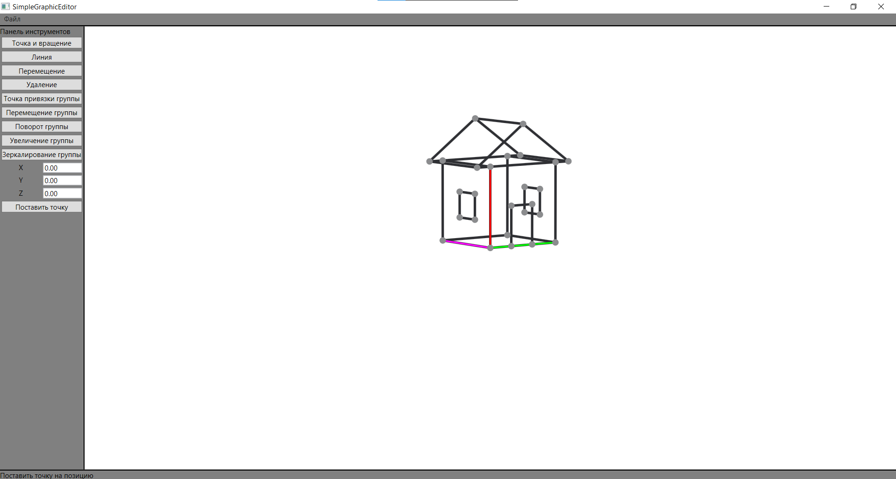
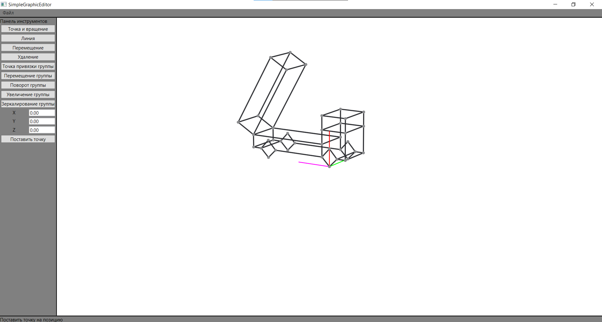
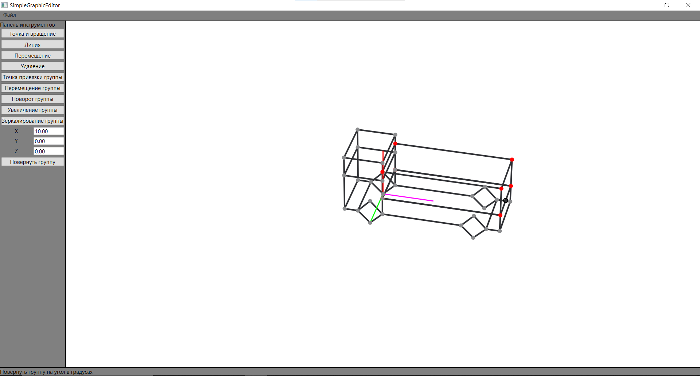

# SimpleGraphicEditor
Простой векторный графический редактор для 5 семестра в ПНИПУ по "Компьютерной графике"
  
## Функции:
1. добавить точку
2. удалить точку вместе с линиями
3. изменить точку
4. добавить линию
5. удалить линию
6. сгруппировать точки
7. разгруппировать точки
8. повернуть группу
9. подвинуть группу
10. отзеркалировать группу
11. вращать сцену
12. сохранить модель в файл
13. загрузить модель из файла

## О коде 
\+ Везде, где можно, использовал механизм привязки.

\+ Вынес классы, отвечающие за DragAndDrop и выделение объектов, так что они теперь удобно подключаются куда нужно.

\- Плохо отделил Model от ViewModel.

## Примеры
### Модель дома

### Модель грузовика

### Демонстрация операций с группами
  
